## Introducci&oacute;n a printers FDM

#### Estas diapositivas: [slides.cuban.tech/3dprint.fdm.intro.html](http://slides.cuban.tech/3dprint.fdm.intro.html)

----------------

### Wifi Info

SSID: cubantech

Password: meet-ups

###### Abel Bajuelos
###### [Olemis Lang](https://linkedin.com/in/olemis)

---

Sitios de eventos CubanTech

- [CubanTech meetups](http://meetup.cuban.tech)
- [Docker Cuba](http://docker.cuban.tech)
- [Blockstack Cuba](http://blockstack.cuban.tech)

---

# Muchas gracias a nuestro anfitri&oacute;n

---

## Entonces, impresi&oacute;n 3D

&iquest;Qui&eacute;nes han escuchado antes?

&iquest;Qui&eacute;nes tienen experiencia previa?

&iquest;Para algo serio?

&iquest;Alg&uacute;n proyecto actual?

---

## Manufactura aditiva
### Procesos

- Extrusi&oacute;n de material (Material extrusion)
- Fusi&oacute;n de capas de polvo (Powder bed fusion)
- Binder jetting
- Estereolitograf&iacute;a
- Litograf&iacute; axial computarizada
- Manufactura por adici&oacute;n de l&iacute;quido
- Laminado
- Deposici&oacute;n por energizaci&oacute;n directa (DED)

---

## Extrusi&oacute;n de material

- FDM / FFF
- Robocasting
- Fabricaci&oacute;n con filamento compuesto (CFF)

---

## &iquest;Qu&eacute; es FDM?

- Fused Deposition Modelling (FDM)
- Tambi&eacute;n conocido como FFF
  * Fused Filament Fabrication

---

## FDM - Proceso de impresi&oacute;n

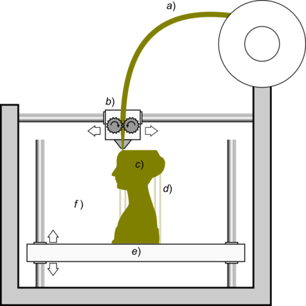

- **a)** Filamento de material pl&aacute;stico

---

## FDM - Proceso de impresi&oacute;n

- **b)** Parte movible caliente
  * derrite, extruye, deposita

---

## FDM - Proceso de impresi&oacute;n

- **c)** Figura construida capa a capa

---

## FDM - Proceso de impresi&oacute;n

- **e)** Base movible.
  * Posici&oacute;n para cada capa

---

## FDM - Proceso de impresi&oacute;n

- **d)** Estructuras de soporte

---

## RepRap - Historia

- Primera impresora 3D de bajo costo
- C&oacute;digo abierto
- Comenz&oacute; la revoluci&oacute;n maker
- M&aacute;s usado a nivel mundial

---

## RepRap - Cuota de mercado

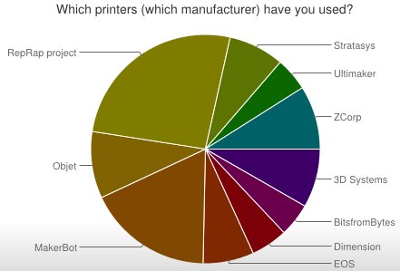

###### fuente : Moilanen, J. & Vad&eacute;n, T.: Manufacturing in motion: first survey on the 3D printing community
###### [Statistical Studies of Peer Production](https://www.este.it/images/file-pdf/3D-Printing_Survey2013.pdf)

---

## &iquest;Qu&eacute; es RepRap?

- M&aacute;quina de manufactura autoreplicante
- Kit de piezas pl&aacute;sticas
- Imprimir otra RepRap para un amigo

---

## RepRap - Prusa i3

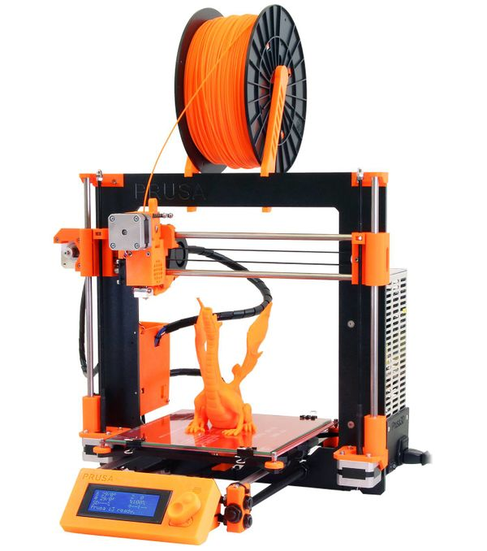

###### Cartesian-XZ-head

--

## Prusa i3 MK3

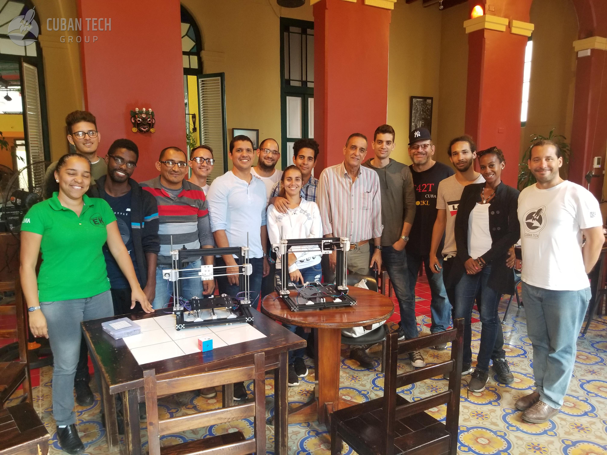

---

## RepRap - Genealog&iacute;a

---

## OctoPrint

- Interfaz web para impresoras 3D FDM
- Control remoto
- Monitoreo
- Plugins
  * [Prometheus](https://github.com/tg44/OctoPrint-Prometheus-Exporter), [Telegram](https://github.com/fabianonline/OctoPrint-Telegram), [Slack](https://github.com/richjoyce/OctoPrint-Slack)
- [OctoPi](https://github.com/guysoft/OctoPi) for Raspberry Pi

---

#### Octoprint - Control

- Streaming de video. Controles visuales.

---

## Octoprint - Temperaturas

---

## Octoprint - GCode

---

## Octoprint - Consola

---

## Octoprint - Perfiles de impresi&oacute;n

---

## Octoprint - Slicer

---

## Octoprint - Planificaci&oacute;n de grabaciones

---

## Estereolitograf&iacute;a

- SLA, SL
- Fabricaci&oacute;n &oacute;ptica
- Foto-solidificaci&oacute;n
- Impresi&oacute;n con resina

---

## Estereolitograf&iacute;a - Or&iacute;genes

- 1980s Hideo Kodama - solidificaci&oacute;n de pol&iacute;meros foto-sensibles UV
- 1984 Jean Claude Andr&eacute; et al. - [patente del proceso](http://bases-brevets.inpi.fr/fr/document/FR2567668/publications.html)
  * Abandonada por Alcatel-Alsthom, CILAS
- 1984 uChuck Hull - [patente del proceso](https://patents.google.com/patent/US4575330A/en)
  * Fund&oacute; 3D Systems

---

### Estereolitograf&iacute;a - Funcionamiento

###### a) Dispositivo emisor de luz (laser o DLP)

--

### Estereolitograf&iacute;a - Funcionamiento

###### b) tanque de resina l&iacute;quida folopolimerizable

--

### Estereolitograf&iacute;a - Funcionamiento

###### c) fondo transparente para iluminaci&oacute;n selectiva

--

### Estereolitograf&iacute;a - Funcionamiento

###### d) resina solidificada, conforma la pieza

--

### Estereolitograf&iacute;a - Funcionamiento

###### e) plataforma de impresi&oacute;n, desplaza la pieza para cada capa

---

## Resultados Cuba - Feria del Habano

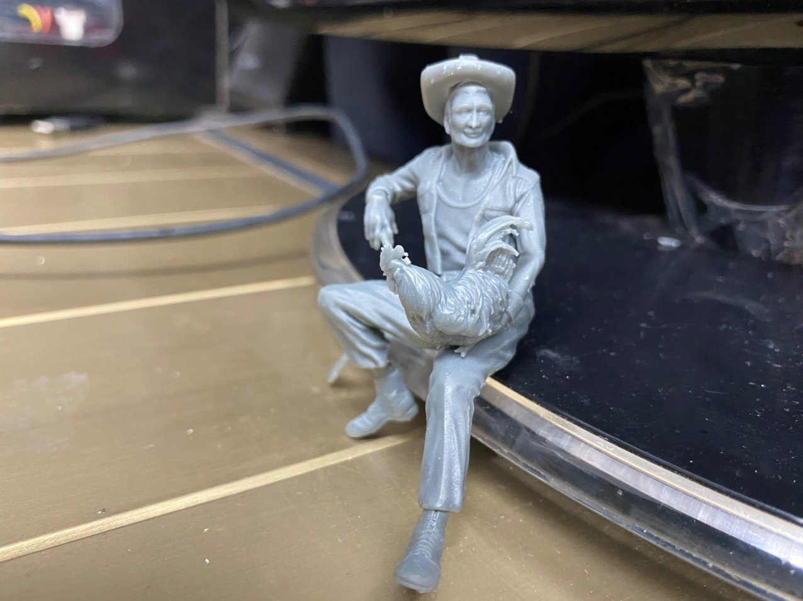

###### Cr&eacute;dito 3D Fab Crearte

--

## Resultados Cuba - Soportes

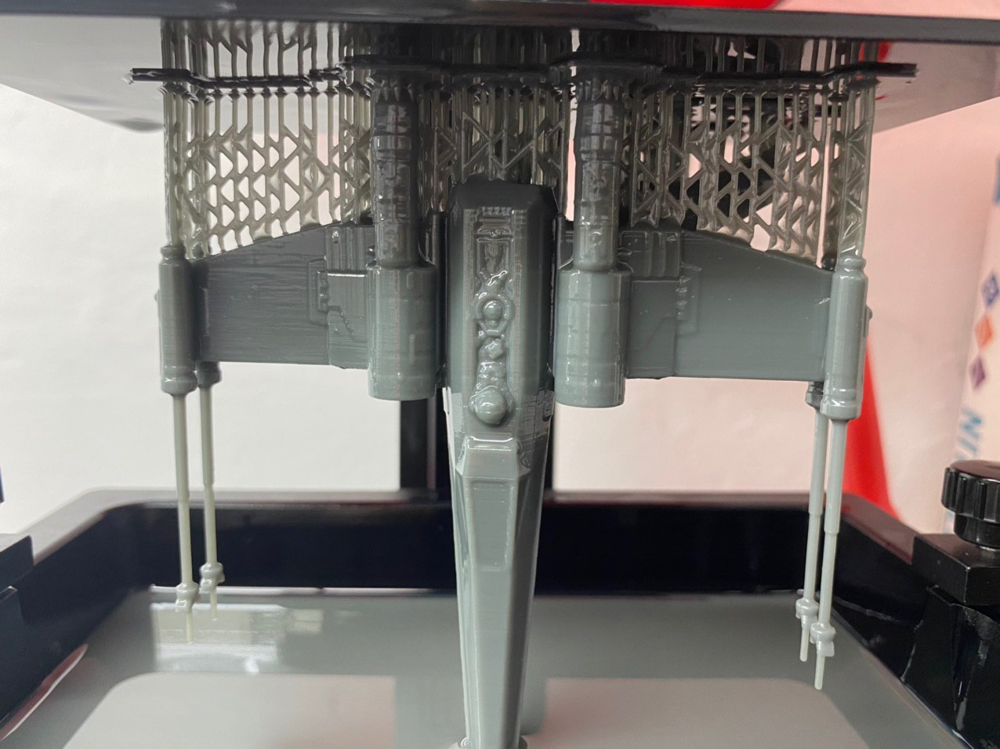

###### Cr&eacute;dito 3D Fab Crearte

---

## SLA - Direcciones de impresi&oacute;n

---

## Proyecto NanoDLP

- Host y control para impresoras 3D SLA / SLS / DLP.
- Multi-plataforma
  * Raspberry Pi
  * Windows, Linux and Mac

---

## NanoDLP - Ventajas

- Baja latencia en Raspberry Pi
- Slicer integrado
- Much&iacute;simas funcionalidades
- Compatibilidad con diferentes componentes

---

### NanoDLP - &iquest;C&oacute;mo funciona?

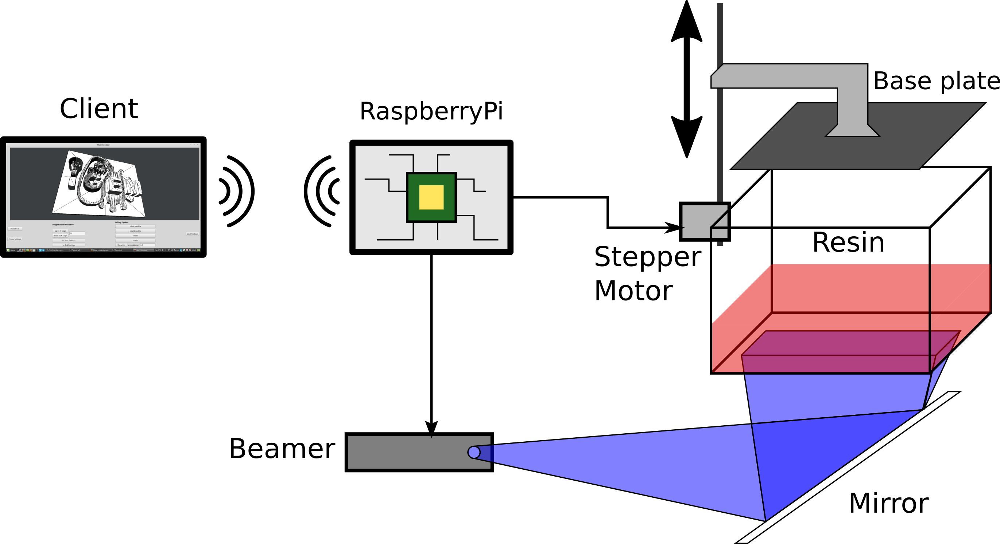

--

## NanoDLP web client

--

## NanoDLP funcionalidades

- Formatos 3D: STL, SLC, SVG, OBJ, PNG.
- Im&aacute;genes por HDMI.
- Controla eje Z, obturador y otro hardware
- Resolution : SD hasta 8K

---

### NanoDLP - &iquest;C&oacute;mo funciona?

--

## NanoDLP - Antialiasing

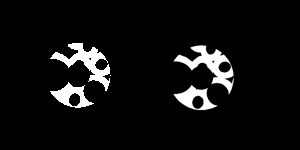

--

## NanoDLP - Pixel dimming

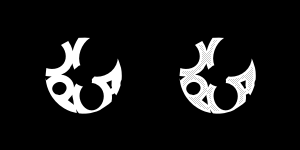

--

## NanoDLP - Distorci&oacute;n

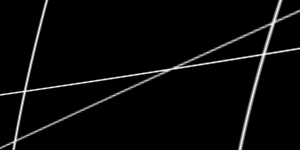

--

## NanoDLP - Hollowing

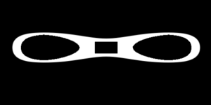

--

## NanoDLP - Infill

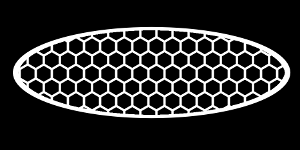

---

## Resumiendo

- &iexcl;Gracias por participar!
- &Uacute;nanse a la comunidad: [t.me/CubanMakers](https://t.me/CubanMakers)

