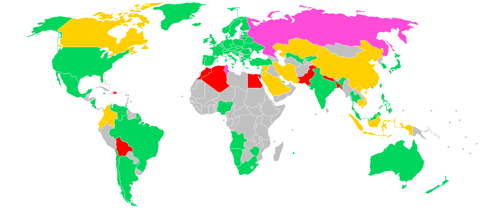
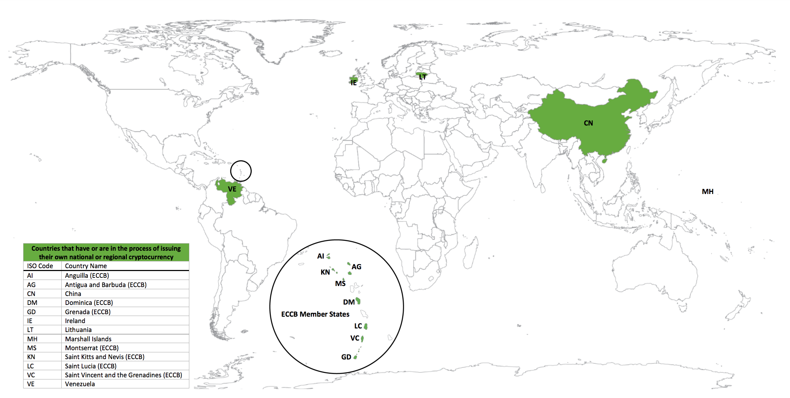
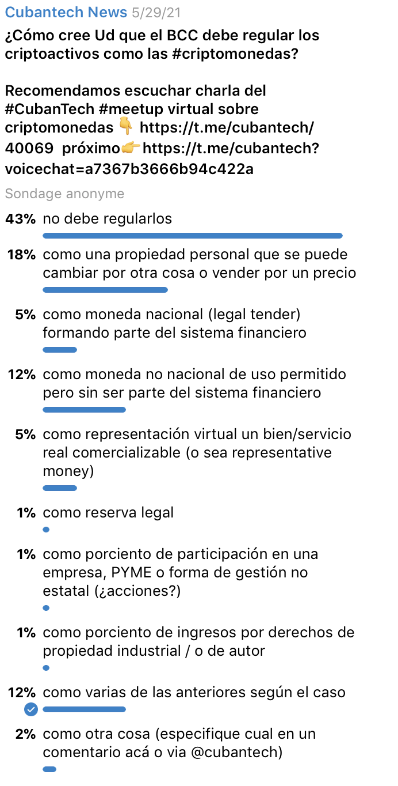
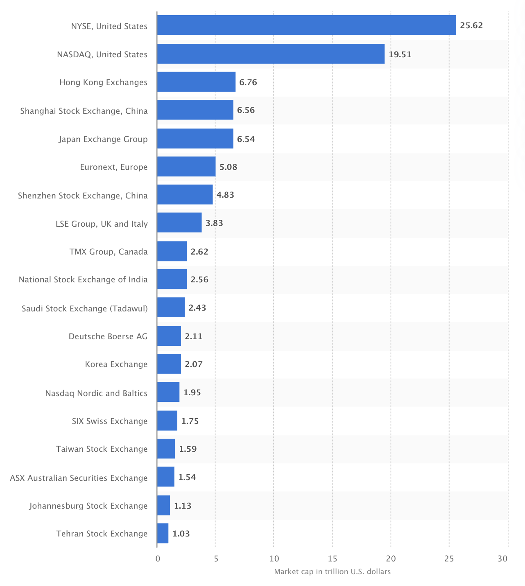

## Criptomonedas 101
#### Conceptos b&aacute;sicos de introducci&oacute;n a la criptomoneda

----------------

#### Diapositivas: [slides.cuban.tech/crypto.intro.html](http://slides.cuban.tech/crypto.intro.html)

----------------

### Informaci&oacute;n de Wifi

Red: cubantech

Contrase&ntilde;a: meet-ups

---

## Objetivos

- El Banco Central de Cuba emite una nota informativa sobre las criptomonedas
  * Disuadir de unirse a esquemas de inversi&oacute;n en criptomonedas
  * El logo de Bitcoin por todas partes
- Detener el F.U.D

---

##  F.U.D [Acr&oacute;nimo en Ingl&eacute;s]

- Miedo [Fear]
- Incertidumbre [Uncertainity]
- Duda [Doubt]

---

## Resumen

- PREGUNTAS Y RESPUESTAS
  * &iquest;Las criptomonedas son dinero real?
  * &iquest;Qu&eacute; es una criptomoneda?
  * &iquest;C&oacute;mo puedo confiar en las criptomonedas si no puedo verlas o tocarlas?
  * Las criptomonedas no est&aacute;n reguladas gubernamentalmente. Prefiero confiar en mi banco y gobierno
  * Usar&eacute; las criptodivisas una vez que comprenda lo que hacen...

<small> No es necesario tener conocimientos previos para entender </small>

--

## Resumen

- PREGUNTAS Y RESPUESTAS
  * La libertad financiera vs Bitcoin vs Gobierno
  * Las criptomonedas son un fraude porque fueron inventadas por Ponzi
  * &iexcl;Hey mam&aacute;! John Doe me ofreci&oacute; cryptos. &iquest;Ser&aacute; un delincuente?
  * &iexcl;Dame las criptomonedas! &iquest;Necesito una cuenta bancaria?
  * &iquest;C&oacute;mo debo usar realmente las cryptos?
  * &iquest;Necesito siempre una wallet [billetera digital]? &iquest;Cu&aacute;l ser&iacute;a la mejor?
  * &iquest;C&oacute;mo puedo ganar dinero minando crypto?

--

## Resumen

- PREGUNTAS Y RESPUESTAS
  * &iquest;Cu&aacute;nto cuestan las transacciones de Bitcoin? &iquest;Superan el 3% de comisi&oacute;n en los cajeros autom&aacute;ticos?
  * Al comprar crypto y su precio se desploma... &iquest;pierdo mi dinero?
  * Yo no quiero m&aacute;s crypto... &iquest;podr&eacute; recuperar mi dinero?... Soy cubano...
  * &iquest;D&oacute;nde se mina Bitcoin?
  * &iquest;Es necesario alg&uacute;n equipo especial para minar crypto?
  * &iquest;Contamina la miner&iacute;a de crypto el medio ambiente?

--

## Resumen

- PREGUNTAS Y RESPUESTAS
  * &iquest;Qui&eacute;n puede ver la cantidad de criptomonedas que tengo?
  * &iquest;Alguien puede confiscar mi cripto?
  * &iquest;C&oacute;mo instrumentar las cryptos en Cuba para la transferencia de dinero a nivel de pa&iacute;s?
    +... &iquest;Evitar el embargo...?
  * ... &iquest;y si compro un ordenador cu&aacute;ntico?... &iexcl;Hey!
  * &iquest;Existe realmente alguien que utilice esto?

<small> No es necesario tener conocimientos previos para entender </small>

--

## Resumen

- C&oacute;mo lanzar una #criptomoneda descentralizada desde #Cuba ?
- &iquest;Qu&eacute; es la volatilidad?
- Si Satoshi Nakamoto regala su/su cripto ( &asymp; 1M BTC) &iquest;qu&eacute; pasar&iacute;a con el precio de Bitcoin?
- M&aacute;s all&aacute; de las criptodivisas ...

---

## Pregunta: &iquest;Son las criptomonedas dinero real?

---

## &iquest;Qu&eacute; es el dinero?

- Medio de intercambio
- Unidad contable
  * Valor relativo de los bienes y servicios
- Dep&oacute;sito de valor
  * Estable, reserva, almac&eacute;n y retorno

---

# Dise&ntilde;o de las criptomonedas: medio de intercambio

<small> Fetiche de intercambio </small>

---

## Tipos de dinero

- Materia prima
  * Oro, plata, sal, caracolas
- Dinero en efectivo
  * Papel moneda
  * Moneda
- Representativo
  * Valor nominal
  * Respaldada por la mercanc&iacute;a, sin ser &eacute;sta.

---

## Tipos de dinero - Fiat

- Valor por regulaci&oacute;n gubernamental
  * Mantiene el valor
- No tiene valor intr&iacute;nseco
- No tiene valor de uso
- Se utiliz&oacute; por primera vez en China en el siglo XI
- 1971 - Nixon desvincul&oacute; a EEUU del oro
  * Adoptado progresivamente en todo el mundo

---

## Tipos de dinero - Moneda del banco comercial

- Cuenta de dep&oacute;sito a la vista
- Los fondos pueden retirarse en cualquier momento mediante cheque o en efectivo
- Sin previo aviso al banco o a la entidad financiera. 
- Tarjetas de pago y cajeros autom&aacute;ticos
  * Tarjetas de cr&eacute;dito
  * Tarjetas de d&eacute;bito
  * Tarjetas de regalo
  * Tarjetas de abastecimiento (flete)

---

## Dinero digital

- Dinero representado digitalmente
- 1990 - En EEUU todo el dinero transferido entre el banco central y los bancos comerciales era electr&oacute;nico

---

## Aspectos pr&aacute;cticos del dinero

- Emitido por el banco central
- De igual a igual
- Electr&oacute;nico
- Accesible universalmente

---

## Taxonom&iacute;a del dinero

--

## Dinero de las materias primas - Ejemplos

- USA [Monedas de metales preciosos](https://catalog.usmint.gov/coins/precious-metal-coins/)
  * Moneda de curso legal promulgada por [Gold Bullion Coin Act of 1985](https://www.govinfo.gov/content/pkg/STATUTE-99/pdf/STATUTE-99-Pg1177.pdf)
  * Materias primas : lingotes de oro, oro, paladio, platino , plata

--

## Dinero en Cuba

- Dinero en efectivo** Ninguno (a mi entender)
- **Efectivo** S&oacute;lo CUP
- **Moneda criptogr&aacute;fica** : Todas (sin legislaci&oacute;n)
- **Criptomoneda emitida por el banco central** Ninguna
- **Mercados de criptomonedas al por mayor** Ninguno . Embargo de EE.UU.

--

## Dinero en Cuba

- **Reservas del banco central**
  * 10% de todos los beneficios del Estado ( [Instrucci&oacute;n 9/2011 BCC](https://www.bc.gob.cu//storage/manual-regulaciones/February2018/aREsS9Qkty2M3FMsQ1Po.pdf) )
  * Reservas internacionales
- **Moneda digital del banco central** MLC
- **Moneda real** desconocida
- **Dep&oacute;sitos bancarios**

---

## Pregunta: &iquest;Qu&eacute; es una criptomoneda?

---

## Taxonom&iacute;a del dinero explicada

- Las criptomonedas son 
  * Peer-to-peer (de par a par, entre iguales)
  * Dinero electr&oacute;nico
  * Minorista vs mayorista
  * Descentralizado vs regulado

---

## &iquest;Qu&eacute; es el dinero al por mayor?

- Grandes sumas de dinero prestadas por las instituciones financieras en los mercados monetarios
  * Grandes empresas
  * Instituciones financieras
- Financiaci&oacute;n a corto plazo
- Es fundamental para los sistemas financieros de EE.
- EUA, la nueva regulaci&oacute;n de los mercados monetarios entr&oacute; en vigor en 2016

---

## Mayoristas de criptodivisas

- Corretaje de voz: directamente con el comerciante, por ejemplo, a trav&eacute;s de Bloomberg, Skype o Slack
- Corretaje electr&oacute;nico: a trav&eacute;s de una API, por ejemplo, FIX , REST

---

## &iquest;Qu&eacute; son las criptomonedas?

- Activo digital como medio de intercambio
- Registros de propiedad de las monedas
- Base de datos informatizada
- Protecci&oacute;n criptogr&aacute;fica
  * Registros seguros de transacciones
  * Control de la creaci&oacute;n de monedas adicionales
  * Validaci&oacute;n de la transferencia de la propiedad de las monedas
- A menos que se indique lo contrario, hablemos de #Bitcoin

---

## Pregunta: Las criptomonedas no est&aacute;n reguladas
#### Conf&iacute;o en mi banco y en mi gobierno

- &iquest;Deber&iacute;a regularse legalmente el cripto en Cuba?
- &iquest;Qu&eacute; aspectos clave incluir&iacute;a?
- &iquest;Qu&eacute; instituciones deber&iacute;an liderar el proceso?

---

## SEC-regulated cryptocurrencies

- [Stacks](https://www.sec.gov/Archives/edgar/data/1719379/000110465919020748/a18-15736_1partiiandiii.htm)
- Insight Notes Linked to the J.P. Morgan Basket of Companies with Exposure to Cryptocurrency (Mar 2021) due May 5, 2022
  * [details at sec.gov](https://www.sec.gov/Archives/edgar/data/0001665650/000121390021014247/s131027_424b2.htm)
- Telegram [TON rejected by SEC](https://www.sec.gov/litigation/complaints/2019/comp-pr2019-212.pdf)
  * [SEC press release](https://www.sec.gov/news/press-release/2019-212) to see why ...
  * HALT !

--

## J.P. Morgan Cryptocurrency Exposure Basket

|                             | <small> Ticker </small> | <small> Share Value </small>       | <small> Stock Weight </small>  | <small> Stock Type </small> |
|-----------------------------|--------|-------------------|---------------|------------|
| <small> MicroStrategy Inc </small>           |  MSTR  |  $0.001           | 20%           |  Class A   |
| <small> Square, Inc.       </small>          |    SQ  |  $0.0000001       | 18%           |  Class A   |
| <small> Riot Blockchain, Inc  </small>       |  RIOT  |     -        | 15%           |  Common    |
| <small> NVIDIA Corporation  </small>         |  NVDA  |   $0.001         | 15%           | Common     |
| <small> PayPal Holdings, Inc.  </small>      |  PYPL  |   $0.0001           | 10%           | Common     |
| <small> Advanced Micro Devices, Inc. </small> |   AMD  |  $0.01                 |  5%           | Common     |

--

## J.P. Morgan Cryptocurrency Exposure Basket

|                             | <small> Ticker </small> | <small> Share Value </small>       | <small> Stock Weight </small>  | <small> Stock Type </small> |
|-----------------------------|--------|-------------------|---------------|------------|
| <small> Taiwan Semiconductor Manufacturing Company Ltd </small> |   TSM  |  NT$10.00         | 5%            | <small> American depositary shares 1x5 common shares </small> |
| <small> Intercontinental Exchange, Inc. </small> |  ICE   |  $0.01            | 4%            | Common     |
| <small> CME Group Inc.    </small>           |   CME  | $0.01             |  4%           |  Class A   |
| <small> Overstock.com, Inc.   </small>       |  OSTK  | $0.0001           |  2%           |  Common    |
| <small> Silvergate Capital Corp. </small>    |    SI  | $0.01              |  2%           | Class A    |

---

## Oferta Inicial de Monedas (ICO)

- Uno de los muchos modelos
- Basado en la [Oferta P&uacute;blica Inicial](https://www.investopedia.com/terms/i/ipo.asp)
- La regulaci&oacute;n de las ICOs depende de c&oacute;mo se categorice esta.
  * Depende de la jurisdicci&oacute;n
- Fiscalidad

--

## ICO - Nueva Zelanda

- Depende de si el token ofrecido est&aacute; categorizado como
  * Valor de deuda
  * Valor de renta variable
  * Producto de inversi&oacute;n gestionado
  * Derivado

--

## ICO - Pa&iacute;ses Bajos

En los Pa&iacute;ses Bajos, las normas aplicables a una ICO concreta dependen de si el token ofrecido se considera un valor o una participaci&oacute;n en una inversi&oacute;n colectiva, una evaluaci&oacute;n que se realiza caso por caso

--

## Fiscalidad

- Israel : se tasa como activo
- Bulgaria : se tasa como activo financiero
- Suiza : se tasa como moneda extranjera
- Argentina y Espa&ntilde;a : sujetas al impuesto sobre la renta
- Dinamarca : sujeta al impuesto sobre la renta y las p&eacute;rdidas son deducibles
- Reino Unido:
  * las empresas pagan el impuesto de sociedades
  * Las empresas no constituidas en sociedad pagan el impuesto sobre la renta
  * Las personas f&iacute;sicas pagan el impuesto sobre las ganancias de capital

---

## Situaci&oacute;n legal de las criptomonedas

&block;&nbsp;legal
&block;&nbsp;regulado
&block;&nbsp;prohibici&oacute;n indirecta
&block;&nbsp;hostil
&block;&nbsp;sin registro

---

## Criptomoneda regulada por el Banco Central
###### Library of Congress, 2018

--

##  Criptomoneda regulada por el Banco Central

- China [yuan digital ](https://www.cnbc.com/2021/03/05/chinas-digital-yuan-what-is-it-and-how-does-it-work.html)... [videos](https://www.youtube.com/digital-yuan)
- Venezuela [Petro](https://web.archive.org/web/20180412202954/http://petro.gob.ve/pdf/en/Whitepaper_Petro_en.pdf)
  * [Petro blockchain explorer](https://registro.blockchain.gob.ve/web/) ?
- ECCB [DCash](https://www.eccb-centralbank.org/p/what-you-should-know-1) de curso legal
- Irlanda
- Lituania [LBCOIN](ihttps://www.lb.lt/en/digital-collector-coin-lbcoin)

--

## Criptograf&iacute;a regulada por el Banco Central - Islas Marshall
- [Sovereign (SOV)](https://sov.foundation/)
- 2018 [Sovereign Currency Act](https://sov.foundation/law.pdf)
- [SOV Whitepaper](https://docsend.com/view/nvi59vw)
- Problema: Alto costo de las remesas
- Basada en el trabajo de la criptomoneda EOS

---

## Pregunta: &iquest;C&oacute;mo implantar las criptomonedas en Cuba para la transferencia de dinero a nivel de pa&iacute;s?

---

## Criptodivisas en Cuba

- Descentralizado (comunidad) vs centralizado (gobierno)
- Marco regulatorio para criptograf&iacute;a y criptomonedas
- Ramificaciones legales

---

## Encuesta en [@cubantech](https://t.me/cubantech)

---

## Crypto en Cuba - Acciones "empresariales"

- **3 votos**... 1%
- Exactamente de lo que se trata la ICO

---

## &iquest;Qu&eacute; pasa con las ICO's en Cuba?

- No hay bolsas de valores, es ilegal
- ...en pocas palabras, &iexcl;Olv&iacute;dalo!
- &iquest;Cambiar&aacute; con la pr&oacute;xima ley y regulaci&oacute;n de empresas?
- &iquest;Socialismo vs capitalismo?

--

## Principales bolsas de valores
###### fuente Statista.com, Feb 2021

<small> China tiene 3er puesto entre los primeros 10 </small>

---

## Venezuela

- Bolsa de Valores de Caracas
  * Completamente electr&oacute;nica desde febrero de 1992
  * SIBE (Sistema Integrado Burs&aacute;til Electr&oacute;nico) desde julio de 1999
- Ticker: BVC
- Moneda: VES

---

## Criptomoneda cubana como reserva legal

- **5 votos**... 1%
- Regulada
- Las empresas pueden utilizarla SOLO en caso de no tener beneficios
- Acumula el 10% del beneficio de la empresa
- Criptomoneda emitida por el banco central al por mayor

---

## Criptomoneda cubana para la propiedad intelectual

- **5 votos** ... 1%
- Tokens no fungibles
- ICO's ... pr&oacute;ximamente
- Fidelidad
  * F&uacute;tbol
    + Zilliqa
    + Olyseum
    + [FCB y Chiliz](https://www.fcbarcelona.com/en/news/1608032/bara-and-blockchain-platform-chiliz-join-forces-for-new-global-alliance-to-increase-interaction-with-fans) votaci&oacute;n de los fans
  * Figuras p&uacute;blicas

---

## Criptomoneda cubana de curso legal

- **22 votos** ... 5%
- Monedas estables 
  * USD (i.e. MLC) vs CUP
  * Casa de cambio (Exchange) => CADECA
- Resolver&iacute;a muchos problemas
  * Doble gasto en TuEnvio.cu, EnZona, etc...
  * No es necesario el papel moneda o la acu&ntilde;aci&oacute;n de monedas
  * DApps

---

## Tipos de stablecoins
### Colateralizado sobre Fiat

- Vinculada al dinero fiat
- Reserva regulada para aplicaciones fintech: [USDC y VISA](https://t.me/cubantech_news/842)
- Utilizado por las bolsas: BUSD, BGBP

---

## Tipos de stablecoins
### Colateralizado sobre Crypto

- Respaldadas por otras criptomonedas
  * Sobre-colateralizada
- Mirror tokens => p. ej. DEX

---

## Tipos de stablecoins
### No Colateralizado (algor&iacute;tmico)

- Sin reserva
- Mecanismo de trabajo para el precio estable
  * ... como los bancos centrales
- Conflictivo para los reguladores
  * Basecoin cerrado por la SEC en diciembre de 2018

