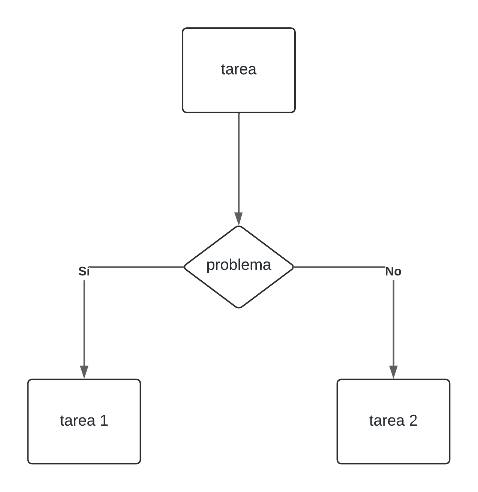

## programacion de videojuegos
---
##### introduccion a la logica de la programacion

--

### puntos de la clase

  * logica computacional

  * resolucion de problematicas

  * introduccion a los videojuegos

  * uso de un Sistema MAC OS

---

## que es la logica computacional?

### veamos un ejemplo simple para entenderlo:

---

## el problema del lobo, el arroz y la gallina

--

### en este problema un hombre debe llevar 3 objetos al otro lado del rio, un lobo, una gallina y un saco de arroz, pero solo puede llevar 1 a la vez, pero el lobo se comeria a la gallina y la gallina al arroz, como es possible?
---

## valor de la respuesta: 10 puntos

---

 un simple problema de organizacion que tiene un orden logico

--

en diagrama de bloques (el Sistema de organizacion de acciones que usan las maquinas) se representa de esta forma la operacion

---

 ### toda maquina cumple estos principios:

  * esta hecha para seguir ciertos pasos en un orden logico
  
  * no pueden saltarse ningun paso a menos que le sea indicado

  * en caso de no poder seguirlos sufrira un error

---

## como resolver problematicas?
---

### comencemos con una pregunta

que haces en tu dia a dia?

---

### durante tu dia pueden ocurrir problemas, por ello es importante tener planes de respaldo
---
las maquinas presentan una forma similar de solucionar problemas, teniendo una respuesta para cada situacion

--

### esta es la forma en la que se representa la toma de decisiones en una maquina

---

### entonces, como funcionan los videojuegos por detras de lo que se ve en pantalla?

--

### todo juego tiene como base la toma de deciciones, justo como las maquinas
---
esto es porque toda la informatica viene de las condicionales

--

*novelas visuales
*juegos de estrategia
*shooter
*mundo abierto

## todos ellos tienen un código detras que toma deciciones cada milisegundo

--

### quien lea primero este texto tiene asegurados 15 puntos

---
## como usar el Sistema de mac

--

#### mac es al igual que windows un Sistema operativo, pero con ciertos cambios significativos, entre ellos:

  * las aplicaciones no abren con ejecutables (.exe)

  * para hacer cambios debes introducir la clave

  * tiene muchas opciones de personalization
---
### debido a que es un Sistema operative distinto, puede que las aplicaciones que existen en uno no esten presentes en el otro

